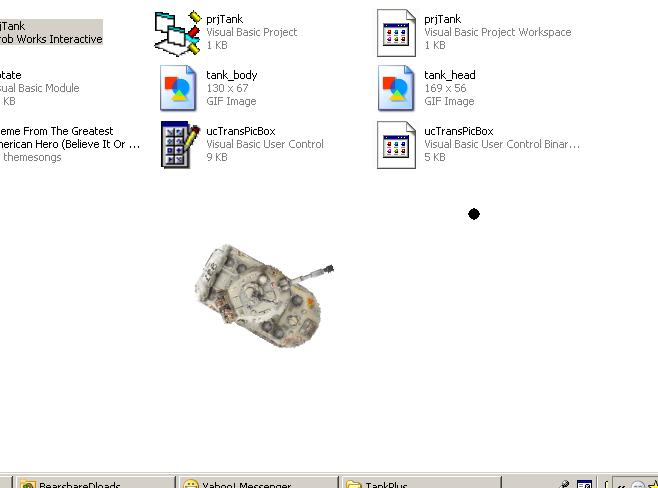



## A Controllable Tank \(It Shoots\)

### Description

Load a tank that you can control... You can let it run through the screen and shoot balls... Rotate its head and its body 360 degrees...

Use controls:

"A" - Move left wheel.. (Clockwise)

"B" - Move right wheel.. (C-Clockwise)

"A"+"B" - Move forward direction

"J" - Move head clockwise

"L" - Move head counter-clockwise

"K" - Shoot balls

Click on it to exit..

Though the graphics work, rotations fully functional (Thanks to Lefteris Eleftheriades), it's pretty slow even with my 80Gb Hard Disk, 512RAM, and 256VideoCard.. There's probably something wrong with the algorithm.. Hope you try it first and check it out.. (^^,)
 
### More Info
 

             |
---                |---
**Submitted On**   |2007-03-28 23:02:34
**By**             |[Ronald Borla](https://github.com/Planet-Source-Code/PSCIndex/blob/master/ByAuthor/ronald-borla.md)
**Level**          |Beginner
**User Rating**    |4.8 (19 globes from 4 users)
**Compatibility**  |VB 6\.0
**Category**       |[Games](https://github.com/Planet-Source-Code/PSCIndex/blob/master/ByCategory/games__1-38.md)
**World**          |[Visual Basic](https://github.com/Planet-Source-Code/PSCIndex/blob/master/ByWorld/visual-basic.md)
**Archive File**   |[A\_Controll2056643282007\.zip](https://github.com/Planet-Source-Code/ronald-borla-a-controllable-tank-it-shoots__1-68231/archive/master.zip)

